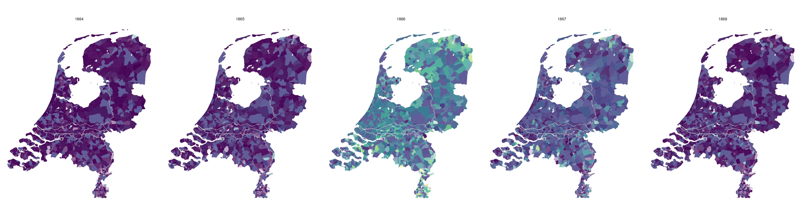
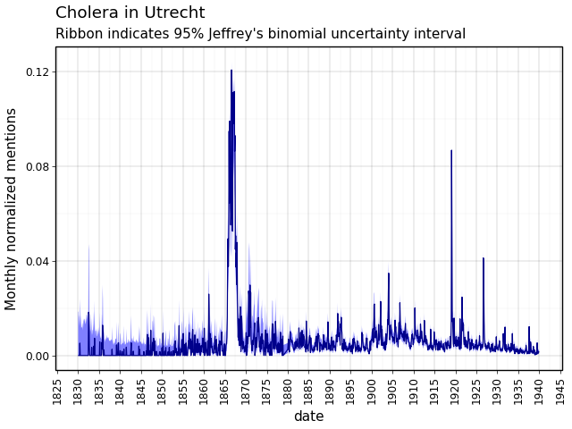

# Disease database 
[](https://www.repostatus.org/#wip)

Creating a historical disease database (19th-20th century) for municipalities in the Netherlands.



## Preparation

This project uses [pyproject.toml](pyproject.toml) to handle its dependencies. You can install them using pip like so:

```
pip install .
```

We recommend using [uv](https://github.com/astral-sh/uv) to manage the environment. First, install uv, then clone / download this repo, then run:

``` 
uv sync
```

this will automatically install the right python version, create a virtual environment, and install the required packages.

Note that if you encountered `error: command 'cmake' failed: No such file or directory`, you need to install [cmake](https://cmake.org/download/) first.
On macOS, run `brew install cmake`. Similarly, you may have to install `apache-arrow` separately as well (e.g., on macOS `brew install apache-arrow`).

Once these dependency issues are solved, run `uv sync` one more time.

## Data extraction (1830-1879)
Between 1830 and 1879, Delpher historical news article data can be downloaded manually from [here](https://www.delpher.nl/over-delpher/delpher-open-krantenarchief/download-teksten-kranten-1618-1879#b1741).
The downloaded files, which are zip folders, take up lots of disk space because of inefficient data format.

The `src/process_open_archive/extract_article_data.py` script extracts the titles and texts from the zip folder for each article.
Then, it stores all extracted data as a polars dataframe with three columns `article_id`, `article_title` and `article_text`.
Finally, it is saved as a parquet file (`article_data_{start_year}_{end_year}.parquet`), with a much smaller size under `processed_data/texts/from_1830_to_1879/`.

With the `src/process_open_archive/extract_meta_data.py` script, we extract meta information about both the newspapers and the individual articles.
This results in two kinds of polars dataframes saved in parquet format under `processed_data/metadata/newspapers/from_1830_to_1879` and `processed_data/metadata/articles/from_1830_to_1879`, respectively.

1) `newspaper_meta_data_{start_year}_{end_year}.parquet` includes these columns: `newspaper_name`, `newspaper_location`,
   `newspaper_date`, `newspaper_years_digitalised`, `newspaper_years_issued`, `newspaper_language`, `newspaper_temporal`,
   `newspaper_publisher` and `newspaper_spatial`.
2) `article_meta_data_{start_year}_{end_year}.parquet` includes these columns: `newspaper_id`, `article_id` and `article_subject`.

Before you run the following script, make sure to put all the Delpher zip files under `raw_data/open_archive`.

```
python src/process_open_archive/extract_article_data.py
python src/process_open_archive/extract_meta_data.py
```

Then, run 

```
python src/process_open_archive/combine_and_chunk.py
``` 
to join all the available datasets and create a yearly-chunked series of parquet files in the folder `processed_data/combined`.

## Data harvesting (1880-1940)
After 1880, the data is not public and can only be obtained through the Delpher API: 

1. Obtain an api key (which looks like this `df2e02aa-8504-4af2-b3d9-64d107f4479a`) from Delpher, then put the api key in the file `harvest_delpher_api/apikey.txt`.
2. Harvest the data following readme in the delpher api folder: [src/harvest_delpher_api/readme.md](./src/harvest_delpher_api/README.md)

## Database creation
After the data has been processed from 1830-1940, the folder `processed_data/combined` should now be filled with `.parquet` files. The first record looks like this:

```py
import polars as pl
pl.scan_parquet("processed_data/combined/*.parquet").head(1).collect().glimpse()
```

```
$ newspaper_id                 <str> 'ddd:010041217:mpeg21'
$ article_id                   <str> 'ddd:010041217:mpeg21:a0001'
$ article_subject              <str> 'artikel'
$ article_title                <str> None
$ article_text                 <str> 'De GOUVERNEUR der PROVINCIE GELDERLAND, prengl bij de__ ler k-nnisse der beUngliebi.cn len ...'
$ newspaper_name               <str> 'Arnhemsche courant'
$ newspaper_location           <str> 'Arnhem'
$ newspaper_date              <date> 1830-01-02
$ newspaper_years_digitalised  <str> '1814 t/m 1850'
$ newspaper_years_issued       <str> '1814-2001'
$ newspaper_language           <str> 'nl'
$ newspaper_temporal           <str> 'Dag'
$ newspaper_publisher          <str> 'C.A. Thieme'
$ newspaper_spatial            <str> 'Regionaal/lokaal'
```

### Step 1: pre-processing / re-partitioning
To make our data processing much faster, we will now process all these files into a hive-partitioned parquet folder, with subfolders for each year. This is done using the following code

```sh
uv run src/create_database/preproc.py
```

After this, the folder `processed_data/partitioned` will contain differently organized parquet files, but they contain the exact same information.

### Step 2: database computation

> NB: from this step onwards, we ran this on a linux (ubuntu) machine with >200 cores and 1TB of memory

The next step is to create the actual database we are interested in. There are three input files for this:

| Input file | Description |
| :--------- | :---------- |
| `raw_data/manual_input/disease_search_terms.xlsx` | Contains a list of diseases and their regex search definitions |
| `raw_data/manual_input/municipalities_1869.xlsx` | Contains a list of locations and their regex search definitions |
| `processed_data/partitioned/**/*.parquet` | Contains the texts of all articles from 1830-1940 |

The following command will take these inputs, perform the regex searches and output (many) `.parquet` files to `processed_data/database_flat`. On our big machine, this takes about 12 hours.

```sh
uv run src/create_database/main.py
```

It may be better to run this in the background without hangups:

```sh
nohup uv run src/create_database/main.py &
```

The resulting data looks approximately like this:

```py
import polars as pl
pl.scan_parquet("processed_data/database_flat/*.parquet").head().collect()
```

```
shape: (5, 8)
┌──────┬───────┬────────────┬────────┬────────────┬─────────┬───────────────┬─────────┐
│ year ┆ month ┆ n_location ┆ n_both ┆ location   ┆ cbscode ┆ amsterdamcode ┆ disease │
│ ---  ┆ ---   ┆ ---        ┆ ---    ┆ ---        ┆ ---     ┆ ---           ┆ ---     │
│ i32  ┆ i8    ┆ u32        ┆ u32    ┆ str        ┆ i32     ┆ i32           ┆ str     │
╞══════╪═══════╪════════════╪════════╪════════════╪═════════╪═══════════════╪═════════╡
│ 1834 ┆ 6     ┆ 1          ┆ 0      ┆ Aagtekerke ┆ 1000    ┆ 10531         ┆ typhus  │
│ 1833 ┆ 12    ┆ 3          ┆ 0      ┆ Aagtekerke ┆ 1000    ┆ 10531         ┆ typhus  │
│ 1834 ┆ 9     ┆ 1          ┆ 0      ┆ Aagtekerke ┆ 1000    ┆ 10531         ┆ typhus  │
│ 1832 ┆ 5     ┆ 1          ┆ 0      ┆ Aagtekerke ┆ 1000    ┆ 10531         ┆ typhus  │
│ 1831 ┆ 4     ┆ 2          ┆ 0      ┆ Aagtekerke ┆ 1000    ┆ 10531         ┆ typhus  │
└──────┴───────┴────────────┴────────┴────────────┴─────────┴───────────────┴─────────┘
```

In this format, the column `n_location` means the number of detected mentions of the location / municipality, and the column `n_both` represents the number of disease mentions within this set of articles mentioning the location.

### Step 3: post-processing

The last step is to organise the data (e.g., sorting by date), compute the normalized mentions, and add uncertainty intervals (through [Jeffrey's interval](https://en.wikipedia.org/wiki/Binomial_proportion_confidence_interval#Jeffreys_interval))

```sh
uv run src/create_database/postproc.py
```

The resulting data folder `processed_data/database` looks like this:

```
database/
├── disease=cholera/
│   └── 00000000.parquet
├── disease=diphteria/
│   └── 00000000.parquet
├── disease=dysentery/
│   └── 00000000.parquet
├── disease=influenza/
│   └── 00000000.parquet
├── disease=malaria/
│   └── 00000000.parquet
├── disease=measles/
│   └── 00000000.parquet
├── disease=scarletfever/
│   └── 00000000.parquet
├── disease=smallpox/
│   └── 00000000.parquet
├── disease=tuberculosis/
│   └── 00000000.parquet
├── disease=typhus/
│   └── 00000000.parquet
```

Now, for example, the typhus mentions in 1838 look like this:
```py
import polars as pl
lf = pl.scan_parquet("processed_data/database/**/*.parquet")
lf.filter(pl.col("disease") == "typhus", pl.col("year") == 1838).head().collect()
```
```
┌─────────┬──────┬───────┬───────────────┬─────────┬───────────────┬─────────────────────┬───────┬──────────┬────────────┬────────┐
│ disease ┆ year ┆ month ┆ location      ┆ cbscode ┆ amsterdamcode ┆ normalized_mentions ┆ lower ┆ upper    ┆ n_location ┆ n_both │
│ ---     ┆ ---  ┆ ---   ┆ ---           ┆ ---     ┆ ---           ┆ ---                 ┆ ---   ┆ ---      ┆ ---        ┆ ---    │
│ str     ┆ i32  ┆ i8    ┆ str           ┆ i32     ┆ i32           ┆ f64                 ┆ f64   ┆ f64      ┆ u32        ┆ u32    │
╞═════════╪══════╪═══════╪═══════════════╪═════════╪═══════════════╪═════════════════════╪═══════╪══════════╪════════════╪════════╡
│ typhus  ┆ 1835 ┆ 1     ┆ Aalsmeer      ┆ 358     ┆ 11264         ┆ 0.0                 ┆ 0.0   ┆ 0.330389 ┆ 6          ┆ 0      │
│ typhus  ┆ 1835 ┆ 1     ┆ Aalst         ┆ 1001    ┆ 11423         ┆ 0.0                 ┆ 0.0   ┆ 0.444763 ┆ 4          ┆ 0      │
│ typhus  ┆ 1835 ┆ 1     ┆ Aalten        ┆ 197     ┆ 11046         ┆ 0.0                 ┆ 0.0   ┆ 0.853254 ┆ 1          ┆ 0      │
│ typhus  ┆ 1835 ┆ 1     ┆ Aarlanderveen ┆ 1002    ┆ 11242         ┆ 0.0                 ┆ 0.0   ┆ 0.330389 ┆ 6          ┆ 0      │
│ typhus  ┆ 1835 ┆ 1     ┆ Aduard        ┆ 2       ┆ 10999         ┆ 0.0                 ┆ 0.0   ┆ 0.262217 ┆ 8          ┆ 0      │
│ typhus  ┆ 1835 ┆ 1     ┆ Akersloot     ┆ 360     ┆ 10346         ┆ 0.0                 ┆ 0.0   ┆ 0.666822 ┆ 2          ┆ 0      │
│ typhus  ┆ 1835 ┆ 1     ┆ Alblasserdam  ┆ 482     ┆ 11327         ┆ 0.0                 ┆ 0.0   ┆ 0.666822 ┆ 2          ┆ 0      │
│ typhus  ┆ 1835 ┆ 1     ┆ Alkmaar       ┆ 361     ┆ 10527         ┆ 0.0                 ┆ 0.0   ┆ 0.045246 ┆ 54         ┆ 0      │
│ typhus  ┆ 1835 ┆ 1     ┆ Alphen        ┆ 1008    ┆ 10517         ┆ 0.0                 ┆ 0.0   ┆ 0.11147  ┆ 21         ┆ 0      │
│ typhus  ┆ 1835 ┆ 1     ┆ Ambt Delden   ┆ 142     ┆ 11400         ┆ 0.0                 ┆ 0.0   ┆ 0.444763 ┆ 4          ┆ 0      │
└─────────┴──────┴───────┴───────────────┴─────────┴───────────────┴─────────────────────┴───────┴──────────┴────────────┴────────┘
```


## Data analysis
> this section is out of date
> 
The script `src/query/faster_query.py` uses the prepared combined data to search for mentions of diseases and locations in articles. The file produces the plot shown above. It also produces this plot about Utrecht:



## Contact


This project is developed and maintained by the [ODISSEI Social Data
Science (SoDa)](https://odissei-soda.nl) team.

Do you have questions, suggestions, or remarks? File an issue in the
issue tracker or feel free to contact the team at [`odissei-soda.nl`](https://odissei-soda.nl)

