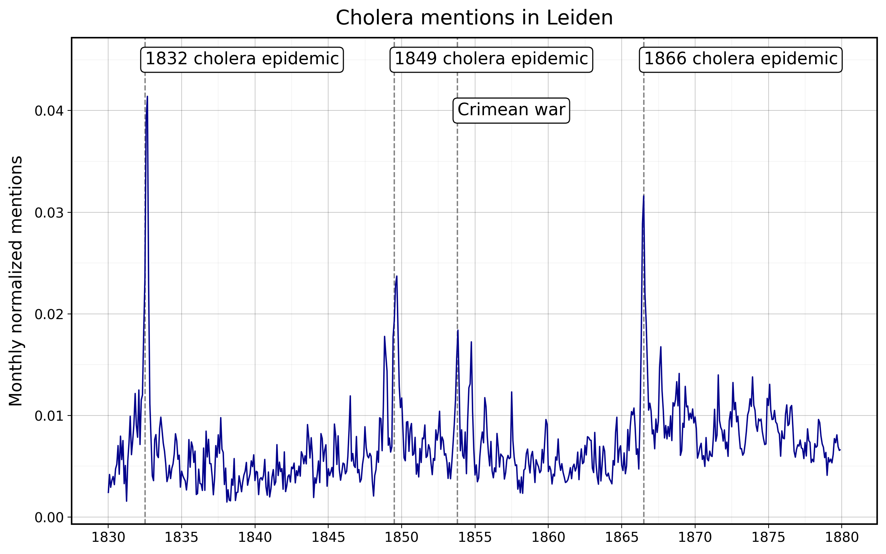
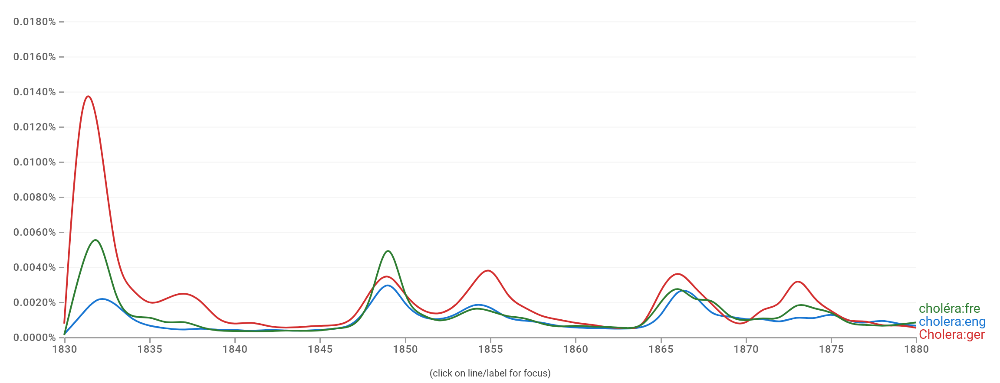

# Disease database 
[](https://www.repostatus.org/#wip)

Creating a historical disease database (19th-20th century) for municipalities in the Netherlands.


## Preparation

```
pip install -r requirements.txt
```

## Data extraction (1830-1879)
Between 1830 and 1879, Delpher historical news article data can be downloaded manually from [here](https://www.delpher.nl/over-delpher/delpher-open-krantenarchief/download-teksten-kranten-1618-1879#b1741).
The downloaded files, which are zip folders, take up lots of disk space because of inefficient data format.

The `extract_article_data.py` script extracts the titles and texts from the zip folder for each article.
Then, it stores all extracted data as a polars dataframe with three columns `article_id`, `article_title` and `article_text`.
Finally, it is saved as a parquet file (`article_data_{start_year}_{end_year}.parquet`), with a much smaller size under `processed_data/texts/from_1830_to_1879/`.

With the `extract_meta_data.py` script, we extract meta information about both the newspapers and the individual articles.
This results in two kinds of polars dataframes saved in parquet format under `processed_data/metadata/newspapers/from_1830_to_1879` and `processed_data/metadata/articles/from_1830_to_1879`, respectively.

1) `newspaper_meta_data_{start_year}_{end_year}.parquet` includes these columns: `newspaper_name`, `newspaper_location`,
   `newspaper_date`, `newspaper_years_digitalised`, `newspaper_years_issued`, `newspaper_language`, `newspaper_temporal`,
   `newspaper_publisher` and `newspaper_spatial`.
2) `article_meta_data_{start_year}_{end_year}.parquet` includes these columns: `newspaper_id`, `article_id` and `article_subject`.

Before you run the following script, make sure to put all the Delpher zip files under `raw_data`.

```
python data_conversion/extract_article_data.py
python data_conversion/extract_meta_data.py
```

Then, run `python data_conversion/combine_and_chunk.py` to join all the available datasets and create a yearly-chunked series of parquet files in the folder `processed_data/combined`.

## Data analysis
The script `query.py` uses the prepared combined data to search for mentions of diseases and locations in articles. The file produces the plot shown above. It also produces this plot about Leiden:



This plot aligns quite nicely with the google ngram viewer, querying "cholera" in an English, German, and French corpus ([click here to see interactively](https://books.google.com/ngrams/graph?content=cholera%3Aeng%2CCholera%3Ager%2Cchol%C3%A9ra%3Afre&year_start=1830&year_end=1880&corpus=en&smoothing=0))



## Additional data harvesting with Delpher API (1880-1940)
For the years 1880 and onward, Dutch historical news articles can be harvested via the Delpher API. 
See `delpher_api/README.md` for details. 

## Contact


This project is developed and maintained by the [ODISSEI Social Data
Science (SoDa)](https://odissei-soda.nl) team.

Do you have questions, suggestions, or remarks? File an issue in the
issue tracker or feel free to contact the team at [`odissei-soda.nl`](https://odissei-soda.nl)

