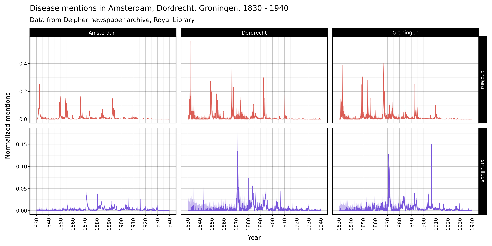

# Disease database 
[](https://www.repostatus.org/#active)
[](https://github.com/sodascience/disease_database/releases/latest)

Code to create a historical disease database (19th-20th century) for municipalities in the Netherlands.


Other things related to this database:

- [Disease database viewer](https://github.com/sodascience/disease_database_viewer): an experimental R shiny app to interactively view the disease database.
- [Initial exploartion into smoothing](https://erikjanvankesteren.nl/blog/smooth_disease) the mention rates within the disease database, using spatial, temporal, and spatiotemporal models.

## Installation

This project uses [pyproject.toml](pyproject.toml) to handle its dependencies. You can install them using pip like so:

```sh
pip install .
```

However, we recommend using [uv](https://github.com/astral-sh/uv) to manage the environment. First, install uv, then clone / download this repo, then run:

```sh
uv sync
```

this will automatically install the right python version, create a virtual environment, and install the required packages. If you choose not to use `uv`, you can replace `uv run` in the code examples in this repo with `python`.

Note, on macOS, if you encounter `error: command 'cmake' failed: No such file or directory`, you need to install [cmake](https://cmake.org/download/) first. On macOS, run `brew install cmake`. Similarly, you may have to install `apache-arrow` separately as well (e.g., on macOS `brew install apache-arrow`).

Once these dependency issues are solved, run `uv sync` one more time.

## Running the data processing pipeline

The full data processing pipeline looks like this:


Each of the separate processing steps (rectangles in the above image) has its own subfolder with its own readme documentation:
- Open archive processing in [`./src/process_open_archive/`](./src/process_open_archive/)
- Delpher API harvesting in [`./src/harvest_delpher_api/`](./src/harvest_delpher_api/)
- Final database creation in [`./src/create_database/`](./src/create_database/)


## Data analysis

For a basic analysis after the database has been created, take a look at the file `src/analysis/query_db.py`. 



For more in-depth analysis and usage scripts, take a look at our analysis repository: [disease_database_analysis](https://github.com/sodascience/disease_database_analysis).


## Contact
This project is developed and maintained by the [ODISSEI Social Data
Science (SoDa)](https://odissei-soda.nl) team.

Do you have questions, suggestions, or remarks? File an issue in the
issue tracker or feel free to contact the team at [`odissei-soda.nl`](https://odissei-soda.nl)

 
