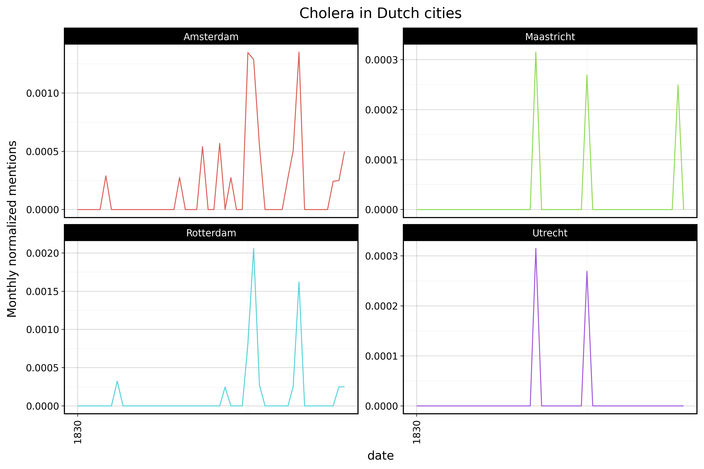

# Disease database 
[](https://www.repostatus.org/#wip)

Creating a historical disease database (19th-20th century) for municipalities in the Netherlands.



## Preparation

```
pip install tqdm polars requests matplotlib plotnine PyQt6
```

## Data extraction
The downloaded delpher xml files are contained in a zip folder, which takes up a lot of storage space.

The `extract_article_data.py` script extracts the titles and texts from the zip folder for each article.
Then, it stores all extracted data as a polars dataframe with three columns `file_name`, `title` and `text`.
Finally, it is saved as a parquet file (`article_data.parquet`), with a much smaller size. 

With the `extract_meta_data.py` script, we extract meta information about both the newspapers and the individual articles.
This results in two separate polars dataframes saved in parquet format:

1) `newspaper_meta_data.parquet` includes these columns: `newspaper_name`, `newspaper_location`,
   `newspaper_date`, `newspaper_years_digitalised`, `newspaper_years_issued`, `newspaper_language`, `newspaper_temporal`,
   `newspaper_publisher`, `newspaper_spatial`, and `pdf_link`.
2) `article_meta_data.parquet` includes these columns: `newspaper_id`, `item_id`, `item_subject`, `item_filename`, and `item_type`.

Before you run the following script, make sure to specify the correct path to the delpher zip folder using `file_path`.

```
python extract_article_data.py
python extract_meta_data.py
```

Then, the script `combine_and_chunk.py` joins these datasets and creates a yearly-chunked series of parquet files in the folder `processed_data/combined`.

## Data analysis
The script `query.py` uses the prepared combined data to search for mentions of diseases and locations in articles. The file produces the plot shown above.

## Contact


This project is developed and maintained by the [ODISSEI Social Data
Science (SoDa)](https://odissei-soda.nl) team.

Do you have questions, suggestions, or remarks? File an issue in the
issue tracker or feel free to contact the team at [`odissei-soda.nl`](https://odissei-soda.nl)

